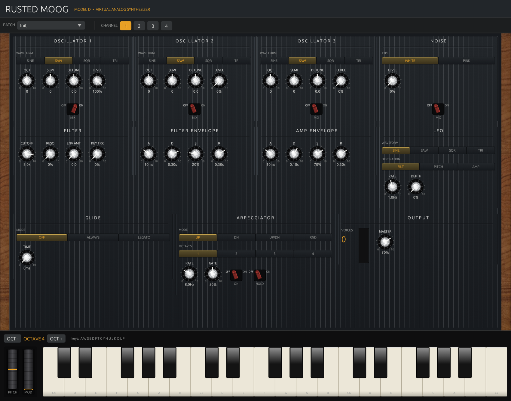

<div align="center">

# 🎛️ Rusted Moog

### A real-time, glitch-free virtual analog synthesizer — written from scratch in Rust.

*A Minimoog-inspired 3-oscillator polysynth with a Moog ladder filter, born from a Python synth that couldn't stop clicking.*

[](https://www.rust-lang.org/)
[](https://github.com/gpasquero/rusted-moog/actions/workflows/ci.yml)
[](LICENSE)
[](#testing)
[](#build--run)

### 🎹 [**Play the real synth in your browser (WebAssembly) →**](https://gpasquero.github.io/rusted-moog/)

*(The actual Rust + egui app compiled to WASM — same panel, same knobs, same sound. No install.)*

*⚠️ In the browser, audio can crackle or lag a little — WebAssembly schedules audio on the main thread. The **native desktop build runs flawlessly** (audio on its own real-time thread). See [Build & run](#-build--run).*



</div>

---

## Why does this exist?

It started as **VOOG**, a synth written in Python + NumPy. It sounded great — until you played a chord. Then it *clicked*, *popped*, and *dropped out*. The culprit wasn't CPU power; it was **garbage-collection pauses and GIL contention firing inside the audio callback**, blowing the 5.8 ms real-time deadline at random.

You can't fix that with faster Python. So we rewrote the whole thing in Rust:

> **No garbage collector. No locks in the audio thread. No allocations in the hot path. No glitches.**

Same synth architecture, deterministic real-time audio, and a GUI that actually looks like hardware.

## ✨ Features

- 🎚️ **3 oscillators** — sine / saw / square / triangle, band-limited wavetables, per-osc octave, semitone, detune & level
- 🔊 **Moog ladder filter** — authentic Huovilainen 24 dB/oct model with resonance, envelope & key-tracking
- 📈 **Dual ADSR envelopes** — independent amp & filter contours
- 🌊 **LFO** — 4 waveforms, routable to filter / pitch / amp
- 🎹 **Jupiter-8-style arpeggiator** — Up / Down / Up&Down / Random, 1–4 octaves, rate, gate and hold (latch)
- 🎹 **8-voice polyphony × 4 multitimbral channels** with oldest-note voice stealing
- 🎛️ **Glide/portamento** (off / always / legato) + white & pink noise
- 🎼 **37 factory presets** — from sub basses to screaming leads, many ported from classic Minimoog patch charts (Parliament, ELP, Wakeman, Taurus…)
- 🎨 **Minimoog-inspired GUI** — custom rotary knobs, VU meter, virtual keyboard (mouse + QWERTY)
- 🎹 **MIDI input** with a full CC map (graceful fallback with no device)

## 🏗️ Architecture

```
┌──────────────────────────────────────────────────────────────┐
│  crate: voog  (binary)                                         │
│                                                                │
│   egui GUI  ──params/notes──►  lock-free queue  ──►  audio     │
│   (main thread)                (crossbeam)          callback   │
│        ▲                                            (cpal RT)   │
│        └──────────── VU / voices ◄─── atomics ─────────┘       │
│                                                                │
│   midir  ──MIDI events──►  same lock-free queue                │
└──────────────────────────────────────────────────────────────┘
                     │ depends on
                     ▼
┌──────────────────────────────────────────────────────────────┐
│  crate: voog-dsp  (library — no I/O, 100% unit-tested)         │
│   oscillator · moog filter · adsr · lfo · noise · glide        │
│   voice · allocator · channel · synth · presets · params       │
└──────────────────────────────────────────────────────────────┘
```

**The real-time contract:** the audio callback never allocates and never locks. The GUI and MIDI threads push events onto a lock-free ring; the callback drains them, renders one block, and publishes meters via atomics. That single discipline is what killed the dropouts.

## 🚀 Build & run

> [!TIP]
> **Run the native build for the real experience.** The audio thread is allocation- and lock-free, so it's rock-solid — no clicks, no dropouts. The [in-browser WASM demo](https://gpasquero.github.io/rusted-moog/) is great for a quick try, but browsers schedule audio on the main thread (no cross-origin isolation on GitHub Pages → no audio worklet thread), so it can crackle or add latency. Native has none of that.

Requires a [stable Rust toolchain](https://rustup.rs/) (edition 2021).

```bash
git clone https://github.com/gpasquero/rusted-moog.git
cd rusted-moog
cargo run --release
```

Play with your **mouse** on the on-screen keyboard, your **computer keyboard** (`A W S E D F T G Y H U J K`), or a **MIDI controller**.

## 🧪 Testing

The entire DSP + engine core is pure and unit-tested — no audio device required:

```bash
cargo test --workspace   # 62 tests
cargo clippy --workspace # zero warnings
```

## 🗺️ Roadmap

- [ ] Patch save/load to disk (JSON, VOOG-compatible)
- [ ] Oversampling for the filter at high resonance
- [ ] Effects: chorus / delay / drive
- [ ] Stereo spread & unison
- [x] Web build via WASM + WebAudio — [live](https://gpasquero.github.io/rusted-moog/)

## 🙏 Credits

Ladder filter after Antti Huovilainen's model. Pink noise via Paul Kellet's approximation. Inspired by the **Moog Minimoog Model D** and **Subsequent 37**. Rebuilt in Rust with [`cpal`](https://github.com/RustAudio/cpal), [`midir`](https://github.com/Boddlnagg/midir) and [`egui`](https://github.com/emilk/egui).

## 📄 License

MIT © gpasquero — see [LICENSE](LICENSE).

<div align="center">
<sub>Built because software instruments should never click.</sub>
</div>
